<p align="center">                    </p>
<h1 align="center">Hi , Nice to see you.</h1>
<h3 align="center">I'm Adan, Frontend developer from  <b>Indonesia</b>.</h3>
<p align="center"> <a href="https://github.com/fardhanardhi"></a> <a href="https://github.com/fardhanardhi"></a> </p>

Mobile & front-end developer, living in Indonesia. I mostly work with JavaScript (Node.js & React.js), but have also experience with Dart (Flutter), PHP, and others.

<h3>Things I code with 💻</h3>
<p>
  
  
  
  
  
  
  
  
  
  
  
  
  
  
  
  
  
  
  
  
  
  
  
</p>

<h3>Where to find me 🤙</h3>
<p><a href="https://github.com/fardhanardhi" target="_blank"></a> <a href="https://twitter.com/fardhanardhi" target="_blank"></a> <a href="https://www.linkedin.com/in/fardhanardhi" target="_blank"></a></p>
<p>
  P.S. I also have some gists, <a href="https://gist.github.com/fardhanardhi" target="_blank">here</a> 
</p>
<hr>
<h3 align="center">My flight hours</h3>
<p align="center">By <a href="https://wakatime.com">WakaTime</a></p>
<p align="center">
<!--   <a href="https://github.com/anuraghazra/github-readme-stats">
    
  </a> -->
  
  <a href="https://github.com/anuraghazra/github-readme-stats">
    
  </a>
  <br>
  <a href="https://github.com/anuraghazra/github-readme-stats">
    
  </a>
  <br>
<!--   <a href="https://github.com/Ashutosh00710/github-readme-activity-graph">
    
  </a> -->
</p>

<p align="center">
  <a href="https://stackoverflow.com/users/6193799/adan">
    
  </a>
</p>

<!--START_SECTION:SHOW_AI_CODING-->


**🐱 My GitHub Data** 

> 📦 385.1 kB Used in GitHub's Storage 
 > 
> 🏆 1,073 Contributions in the Year 2026
 > 
> 💼 Opted to Hire
 > 
> 📜 77 Public Repositories 
 > 
> 🔑 37 Private Repositories 
 > 
**I'm an Early 🐤** 

```text
🌞 Morning                1005 commits        ████░░░░░░░░░░░░░░░░░░░░░   16.39 % 
🌆 Daytime                2768 commits        ███████████░░░░░░░░░░░░░░   45.15 % 
🌃 Evening                1919 commits        ████████░░░░░░░░░░░░░░░░░   31.31 % 
🌙 Night                  438 commits         ██░░░░░░░░░░░░░░░░░░░░░░░   07.15 % 
```
📅 **I'm Most Productive on Monday** 

```text
Monday                   1063 commits        ████░░░░░░░░░░░░░░░░░░░░░   17.34 % 
Tuesday                  985 commits         ████░░░░░░░░░░░░░░░░░░░░░   16.07 % 
Wednesday                1056 commits        ████░░░░░░░░░░░░░░░░░░░░░   17.23 % 
Thursday                 1045 commits        ████░░░░░░░░░░░░░░░░░░░░░   17.05 % 
Friday                   852 commits         ███░░░░░░░░░░░░░░░░░░░░░░   13.90 % 
Saturday                 699 commits         ███░░░░░░░░░░░░░░░░░░░░░░   11.40 % 
Sunday                   430 commits         ██░░░░░░░░░░░░░░░░░░░░░░░   07.01 % 
```


📊 **This Week I Spent My Time On** 

```text
🕑︎ Time Zone: Asia/Jakarta

💬 Programming Languages: 
TypeScript               14 hrs 47 mins      ███████████░░░░░░░░░░░░░░   45.73 % 
Other                    6 hrs 28 mins       █████░░░░░░░░░░░░░░░░░░░░   20.04 % 
Markdown                 4 hrs 25 mins       ███░░░░░░░░░░░░░░░░░░░░░░   13.69 % 
JavaScript               3 hrs 44 mins       ███░░░░░░░░░░░░░░░░░░░░░░   11.56 % 
JSON                     1 hr 36 mins        █░░░░░░░░░░░░░░░░░░░░░░░░   04.96 % 

🔥 Editors: 
Claude Code              21 hrs 16 mins      ████████████████░░░░░░░░░   65.77 % 
VS Code                  11 hrs 4 mins       █████████░░░░░░░░░░░░░░░░   34.23 % 

🐱‍💻 Projects: 
ppa-team-auto-cico-dashbo12 hrs 38 mins      ██████████░░░░░░░░░░░░░░░   39.10 % 
hpr_onboard              7 hrs 42 mins       ██████░░░░░░░░░░░░░░░░░░░   23.85 % 
ppa_team                 6 hrs 34 mins       █████░░░░░░░░░░░░░░░░░░░░   20.35 % 
ppa-odo                  3 hrs 10 mins       ██░░░░░░░░░░░░░░░░░░░░░░░   09.84 % 
startech-task-management 1 hr 49 mins        █░░░░░░░░░░░░░░░░░░░░░░░░   05.62 % 

💻 Operating System: 
Mac                      32 hrs 20 mins      █████████████████████████   100.00 % 
```

🤖 **AI Coding This Week** 

```text
⏱ AI Coding Time: 26 hrs 43 mins (82.66%)

✍️ 4,974 lines written by AI, 1,384 lines written by hand (78.23% AI-written)

🔤 9,397,030 Input Tokens, 809,215 Output Tokens

💵 $134.75 Estimated AI Cost This Week

🧠 41 AI Sessions, 457 AI Prompts

Sonnet                   3,399 lines         █████████████████░░░░░░░░   66.99 % 
Opus                     1,675 lines         ████████░░░░░░░░░░░░░░░░░   33.01 % 
Claude-Code              0 lines             ░░░░░░░░░░░░░░░░░░░░░░░░░   00.00 % 
Haiku                    0 lines             ░░░░░░░░░░░░░░░░░░░░░░░░░   00.00 % 

🔎 AI Coding Insights:
🤖 AI-Driven — 78.23% of written lines came from AI
📚 Verbose Prompter — average 1,637 characters per prompt
🔁 Iterative Prompter — average 11 prompts per session
🚀 High AI Trust — 21.77% of changed lines were hand-edited
```

**I Mostly Code in JavaScript** 

```text
JavaScript               22 repos            ██████░░░░░░░░░░░░░░░░░░░   22.92 % 
TypeScript               6 repos             ██░░░░░░░░░░░░░░░░░░░░░░░   06.25 % 
Go                       3 repos             █░░░░░░░░░░░░░░░░░░░░░░░░   03.12 % 
C++                      3 repos             █░░░░░░░░░░░░░░░░░░░░░░░░   03.12 % 
Lua                      1 repo              ░░░░░░░░░░░░░░░░░░░░░░░░░   01.04 % 
```


**Timeline**


 Last Updated on 01/09/2026 03:00:19 UTC
<!--END_SECTION:SHOW_AI_CODING-->

<p align="center">No commit == busy IRL</p>

<p align='center'>
</img></p>
  
